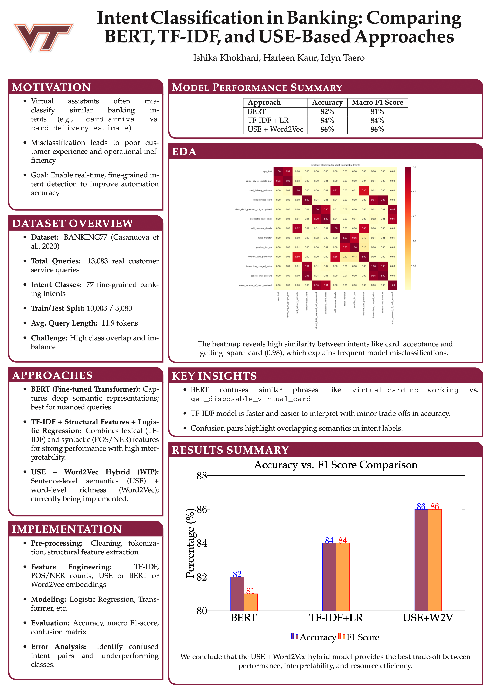

# Banking-Intent-Classification-NLP
Developed an NLP system using the BANKING77 dataset to classify 77+ banking intents with 86% accuracy and macro F1. Compared BERT, TF-IDF+LR, and Word2Vec+USE models. Enhanced query routing to reduce misclassification, enabling faster resolutions, lower costs, and improved customer satisfaction.

# Banking Intent Classification – NLP Project

## 📌 Overview
This project focuses on **intent classification for banking customer service automation** using the **BANKING77 dataset**. With 77 fine-grained intents, customer queries often contain overlapping semantics (e.g., *card_arrival* vs. *card_delivery_estimate*), making accurate classification critical for effective query routing.

Our solution compares **BERT**, **TF-IDF + Logistic Regression**, and a **hybrid Word2Vec + Universal Sentence Encoder (USE)** approach to improve chatbot understanding and reduce customer service costs.

---

## 🎯 Why This Matters
In digital banking, **misclassified queries lead to delays, increased support costs, and poor customer experience**. By improving intent classification, virtual assistants can route queries more accurately, boosting **first-contact resolution rates** and **customer satisfaction**.

---

## 📂 Dataset
- **Dataset**: [BANKING77](https://huggingface.co/datasets/polyai/banking77)
- **Total Queries**: 13,083 (real customer queries)
- **Intent Classes**: 77
- **Split**: 10,003 train / 3,080 test
- **Avg. Query Length**: ~12 tokens

---

## ⚙️ Approaches
1. **BERT (Fine-tuned Transformer)**
   - Captures deep contextual embeddings.
   - Accuracy: **82%** | Macro F1: **81%**

2. **TF-IDF + Logistic Regression**
   - Combines lexical features with syntactic structure (POS/NER).
   - Accuracy: **84.8%** | Macro F1: **84.4%**

3. **Word2Vec + USE Hybrid** ✅ **Best Model**
   - USE: Sentence-level semantics
   - Word2Vec: Lexical richness
   - Accuracy: **86.4%** | Macro F1: **86.4%**

---

## 📊 Results Summary
| Model                  | Accuracy | Macro F1 |
|-------------------------|----------|----------|
| BERT                   | 82.2%    | 81.0%    |
| TF-IDF + Logistic Reg. | 84.8%    | 84.4%    |
| Word2Vec + USE Hybrid  | **86.4%**| **86.4%**|

---

## 🚀 Key Contributions
- Implemented multiple NLP pipelines for **fine-grained intent detection**.
- Achieved **86% accuracy** with hybrid embeddings, outperforming transformer-based models.
- Improved query routing to reduce misclassification, leading to **faster resolutions, lower support costs, and better customer satisfaction**.

---

## 🛠️ Tech Stack
- **Languages**: Python
- **Libraries**: TensorFlow, PyTorch, Scikit-learn, spaCy, HuggingFace Transformers
- **NLP Techniques**: BERT, Word2Vec, Universal Sentence Encoder, TF-IDF
- **Evaluation**: Accuracy, Macro F1, Confusion Matrix

---

## 📈 Business Impact
- Reduced misrouting of customer queries.
- Improved **first-contact resolution** and **support efficiency**.
- Scalable for deployment in real-world banking chatbots.

---

## 📜 Authors
- Harleen Kaur
- Ishika Khokhani
- Icyln Taero
